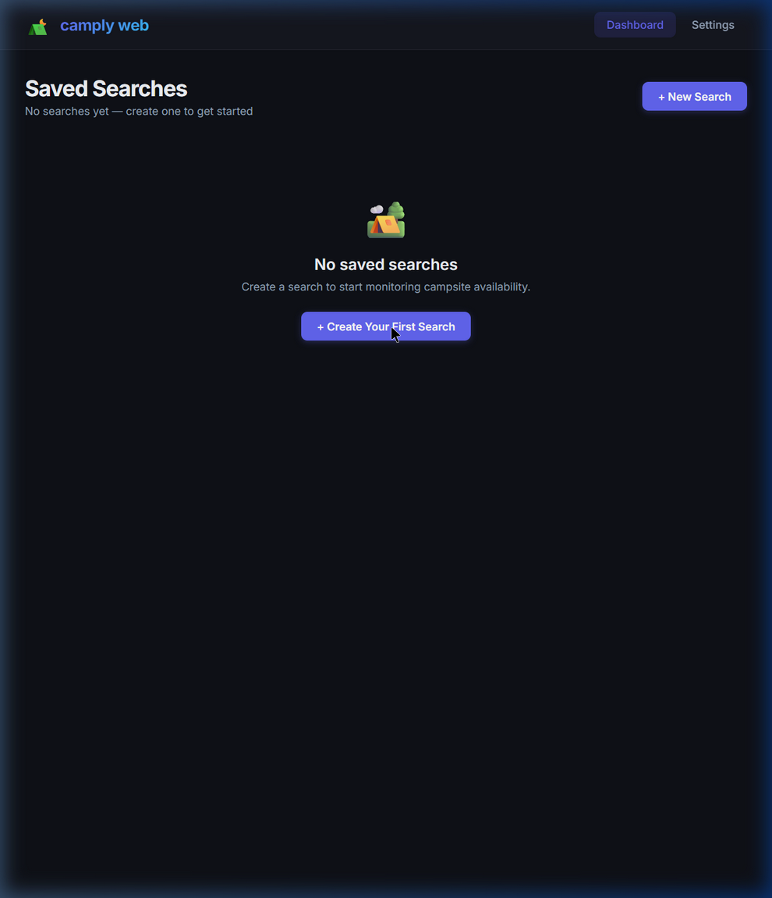
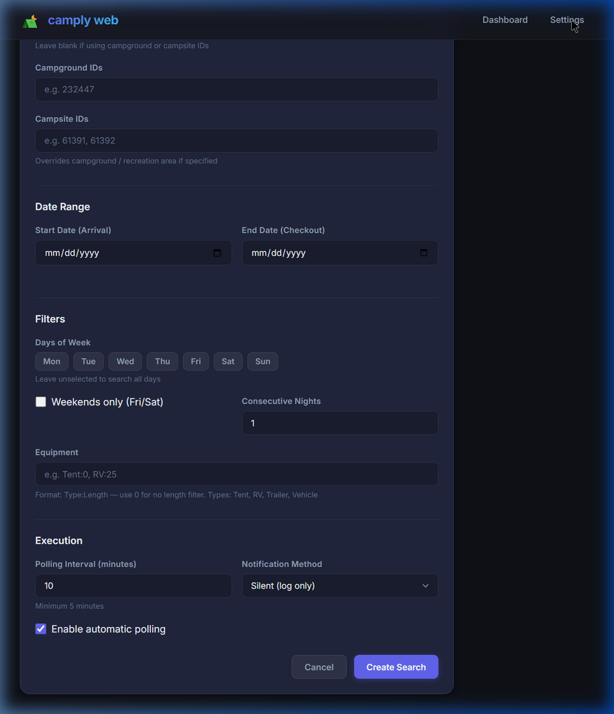
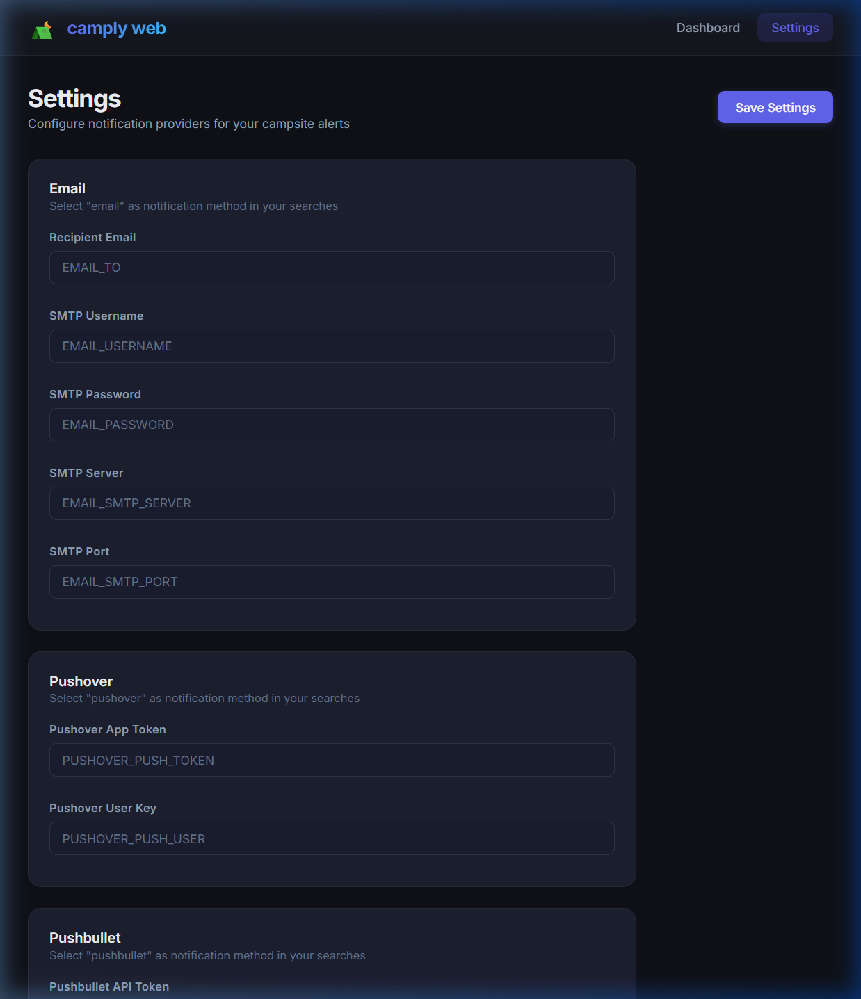

# camply-web ⛺

Web UI for [camply](https://github.com/juftin/camply) — monitor campsite availability and get notified when sites open up.

<p align="center">
  
  
</p>
<p align="center">
  
</p>

## Features

- **Saved Searches** — Create and manage multiple campsite searches with different providers, locations, and date ranges
- **Automatic Polling** — Searches run on a configurable schedule (minimum 5 minutes)
- **Notifications** — Email, Pushover, Slack, Telegram, Twilio (SMS), ntfy, Apprise, Webhook
- **Alert History** — Track every campsite match with booking links
- **All Providers** — Recreation.gov, GoingToCamp, Yellowstone, ReserveCalifornia, and 15+ more

## Quick Start

```yaml
# docker-compose.yml
services:
  camply-web:
    image: ghcr.io/gclenaghan/camply-web:latest
    ports:
      - "8080:8000"
    volumes:
      - camply-data:/app/data
    environment:
      EMAIL_TO_ADDRESS: "you@example.com"
      EMAIL_USERNAME: "smtp-user@example.com"
      EMAIL_PASSWORD: "your-password"
      EMAIL_SMTP_SERVER: "smtp.gmail.com"
      EMAIL_SMTP_PORT: "465"
      EMAIL_FROM_ADDRESS: "camply@juftin.com"
      EMAIL_SUBJECT_LINE: "Camply Notification"

volumes:
  camply-data:
```

```bash
docker compose up -d
# Open http://localhost:8080
```

## Development

```bash
# Backend
pip install -e ".[dev]"
uvicorn backend.main:app --reload

# Frontend
cd frontend
npm install
npm run dev
```

## Architecture

- **Backend**: Python/FastAPI, SQLite (SQLAlchemy), APScheduler
- **Search Engine**: Shells out to `camply` CLI using YAML configs
- **Frontend**: React (Vite), dark-mode UI
- **Docker**: Multi-stage build, multi-platform (amd64/arm64)